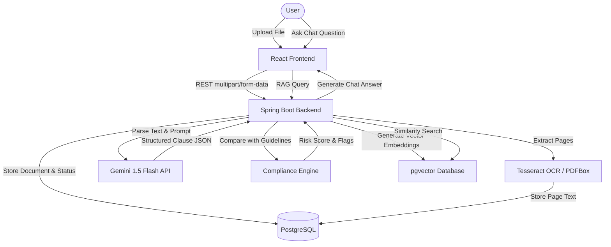
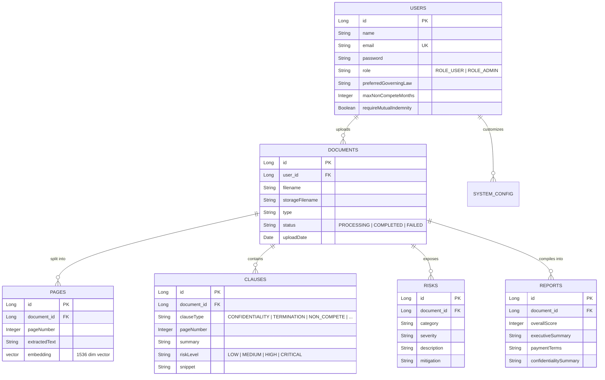

# LexiGuard AI — Legal Contract Auditor & Risk Analyzer (RC 1.0)

LexiGuard AI is a modern SaaS portfolio platform designed to automate pre-signature contract reviews. By leveraging state-of-the-art AI (Gemini 1.5), Optical Character Recognition (OCR), and pgvector RAG memory stores, LexiGuard AI identifies unfavorable clauses, assesses overall legal exposure scores, and aligns agreements with custom signing guidelines.

---

## 🚀 [Live Demo 
](https://lexiguard-ai-gamma.vercel.app)

- 🌐 **Frontend (Vercel):** https://lexiguard-ai-gamma.vercel.app
- ⚙️ **Backend API (Railway):** https://lexiguard-ai.up.railway.app
- ❤️ **Health Check:** https://lexiguard-ai.up.railway.app/api/health

---

## 🚀 Key Features

*   **Smart OCR Engine**: Extracts structured text from scanned paper contracts and non-searchable PDF attachments.
*   **AI plain English Summaries**: Translates dense legal terminology into simple executive overviews, payment details, and date tables.
*   **Dynamic Clause Tagging**: Classifies termination covenants, non-competes, mutual liability caps, governing laws, and IP rights.
*   **Automated Risk Score Calculator**: Scores documents from `0` (compliant) to `100` (critical exposure) with color-coded risk alerts.
*   **RAG Document Q&A Chat**: Ask conversational questions (e.g. "Who owns the IP?") and retrieve precise page citations.
*   **Before You Sign Compliance Checker**: Compares detected clauses against user-configured guidelines (e.g. max non-compete periods, preferred states).
*   **Multi-Page PDF Report Exporter**: Generates professional multi-page PDF audit reports with Apache PDFBox.

---

## 🛠 Tech Stack

*   **Backend**: Java 21, Spring Boot 3.4.1, Spring Security, Spring Data JPA, Apache PDFBox 3.0.3, Tesseract OCR
*   **Frontend**: React 19, Material UI v6, TypeScript, Vite
*   **Database & AI Integration**: PostgreSQL 16+ with `pgvector` extension, LangChain4j, Gemini 1.5 Flash API
*   **Testing**: JUnit 5, Mockito, Spring Boot Integration Testing, H2 Database

---

## 🏗 System Architecture Flow

The following diagram illustrates the lifecycle of a contract review inside LexiGuard AI:



---

## 📊 Database Schema Model (ERD)

The relational database model preserves users, uploaded agreements, individual text pages, extracted clauses, risk mitigations, and compliance settings:



---

## 📂 Repository Layout

```
lexiguard-ai/
├── backend/
│   ├── src/
│   │   ├── main/
│   │   │   ├── java/com/lexiguard/
│   │   │   │   ├── config/          # Spring Security, JPA, AI configs
│   │   │   │   ├── controller/      # REST Endpoints (Auth, Doc, Admin)
│   │   │   │   ├── entity/          # JPA Entity definitions
│   │   │   │   ├── repository/      # Persistent DB interfaces
│   │   │   │   └── service/         # Business logic (Gemini, OCR, RAG)
│   │   └── test/                    # Integration & Controller Tests
│   └── pom.xml
├── frontend/
│   ├── src/
│   │   ├── context/                 # React Auth & Theme contexts
│   │   ├── pages/                   # Landing, Dashboard, Admin, About, Contact
│   │   └── services/                # Axios API endpoints configuration
│   └── package.json
└── docker-compose.yml
```

---

## 🛠 Setup & Installation Guide

### Prerequisites
1. **Java 21 JDK** installed.
2. **Node.js 20+** installed.
3. **PostgreSQL 16** (with `pgvector` extension enabled).
4. **Tesseract OCR** binaries installed (configured in PATH).
5. **Gemini API Key** from Google AI Studio.

### Database Setup
Ensure `pgvector` is active in your PostgreSQL database instance:
```sql
CREATE DATABASE lexiguard;
\c lexiguard;
CREATE EXTENSION IF NOT EXISTS vector;
```

### Environment variables
Create a `.env` file at the root folder containing your credentials:
```env
GEMINI_API_KEY=your_gemini_api_key_here
DB_URL=jdbc:postgresql://localhost:5432/lexiguard
DB_USER=postgres
DB_PASSWORD=your_password
```

### Run Backend
```bash
cd backend
./mvnw spring-boot:run
```

### Run Frontend
```bash
cd frontend
npm install
npm run dev
```

---

## 📡 API Reference Overview

| Method | Endpoint | Description | Access |
| :--- | :--- | :--- | :--- |
| **POST** | `/api/auth/register` | Register user account | Public |
| **POST** | `/api/auth/login` | Login user & return tokens | Public |
| **POST** | `/api/documents/upload` | Upload new PDF/DOCX agreement | Authenticated |
| **POST** | `/api/documents/{id}/process` | Trigger OCR & AI Analysis | Authenticated |
| **GET** | `/api/documents/{id}/pages` | Retrieve page-by-page text blocks | Authenticated |
| **GET** | `/api/documents/{id}/report` | Get summary risk audit report | Authenticated |
| **GET** | `/api/documents/{id}/export` | Download compiled multi-page PDF | Authenticated |
| **POST** | `/api/documents/{id}/chat` | Query contract Q&A RAG engine | Authenticated |
| **GET** | `/api/admin/stats` | Retrieve global platform metrics | Admin Only |
| **PUT** | `/api/admin/config` | Update active AI models & parameters | Admin Only |

---

## ⚖ Disclaimer

LexiGuard AI provides automated legal document scanning and risk summary models. The generated information, statistics, checklist matches, and exported report sheets do not constitute formal legal counsel. Always consult a qualified legal professional or attorney before signing binding agreements.
